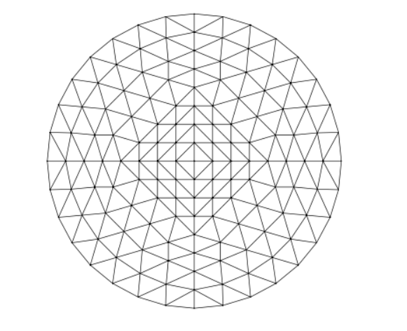

# Finite Element Stokes Solver for Laminar Pipe Flow

The aim of this project is to compute the laminar velocity profile in a circular pipe at low Reynold's number using the __finite element method__.

The simulation is developed in python using the "scikit-fem" library:

https://scikit-fem.readthedocs.io/en/latest/index.html

The code can be found in the "notebook" subfolder of this repository in the form of a jupyter notebook "flow.ipynb". It is assumed that the user has the standard anaconde package is installed.

## Assumptions

We assume that the flow is:

1) Steady,
2) Incompressible,
3) Fully developed,
4) in the low Reynold's numbers regime.

The pipe is oriented along the $z$-axis and $w(x,y)$ denotes the __axial velocity__, that is the velocity in the z-direction, at a point $(x,y)$ on a crosssection of the pipe.

Under these assumptions:

1) Only the axial velocity, $w(x,y)$ is nonzero, meaning that the no fluid motion occurs in the radial direction ( sideways ).
2) The pressure gradient, $\frac{dp}{dz}$.

Furthermore, we are assuming a __no-slip__ condition at the wall 

$$w=0\quad\text{on }\partial\Omega$$

## Derivation weak form

The strong form of the axial momentum equation on the cross-section $\Omega$ is:

$$-\mu\nabla^2w=\frac{dp}{dz},$$

where $\mu$ is the __dynamic viscosity__ and $\frac{dp}{dz}$ is the __constant axial pressure gradient__ driving the flow.

Let $$f=-\frac{1}{\mu}\frac{dp}{dz}=const,$$
be the __normalized pressure gradient. 

The weak form of equation can be derived to be: 

$$\int_\Omega \nabla w \cdot \nabla v  d\Omega = \int_\Omega f v d\Omega \quad \forall v \in V_0$$

with $V_0 = H_0^1(\Omega)$ (zero on boundary → no-slip).

We seek the axial velocity, $w \in V_0$ that satisfies the above equation.

The resulting solution for $w$ will be compared to the analytical __Hagen–Poiseuille__ velocity profile.

### 2. Discretization idea

A 2D mesh of the cross-section consisting of triangles will be used.

We will choose piecewise linear $P_1$ elements.

We will solve the following linear system
$$K \mathbf{w} = \mathbf{f}$$ , where
    - $$K_{ij} = \int_\Omega \nabla \phi_i \cdot \nabla \phi_j , d\Omega)
    - (f_i = \int_\Omega f \phi_i , d\Omega$$ 

is the __stiffness__ matrix and f is the load vector.

# Results

The following plot made in the accompanying code verifies that the velocity is at its maximum in the center of the pipe and deteriorates towards the wall, becoming zero at the wall in consistence with the Dirichlet no-slip boundary condition.

![[Pasted image 20260520222506.png]]

Plotting the radial velocity, $w$, gives the following plot:

![[Pasted image 20260521130354.png]]

¨From this plot it can seen that velocity it is a maximum in the center of the pipe and goes to zero when moving towards to wall in a manner that resembles a parabolic curve.

The maximum is, from python, $\omega_{max}=0.247 m/s$. 

The hagen-Poiseuille equations, as applied to these circumstances, gives:

𝑟
2
.
